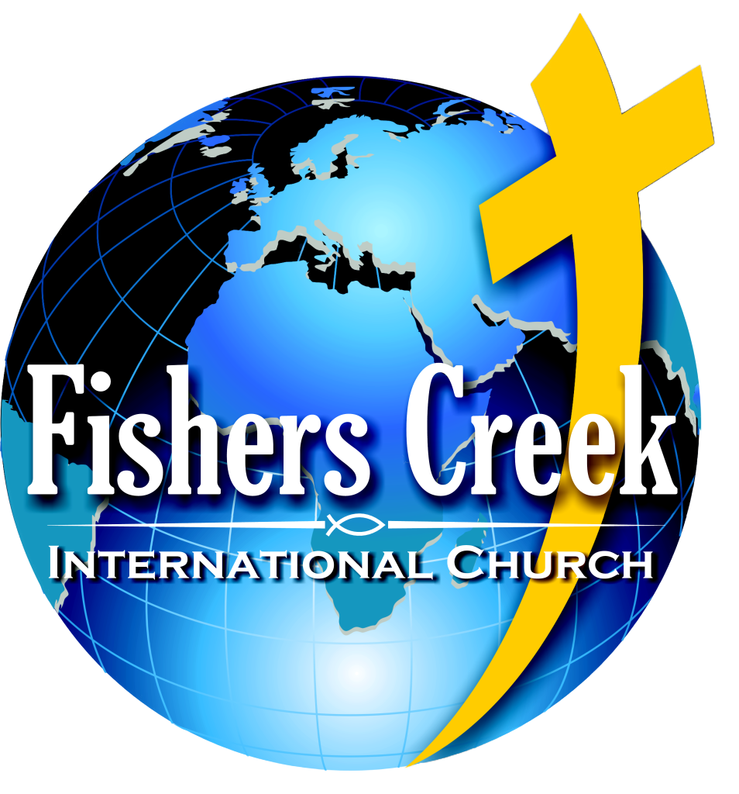

## Welcome to Fishers Creek International Church's Github 👋  
 

 <i>Loving God, Loving People</i>  

### English speaking church in Gothenburg.
We are a non-denominational church based in Göteborg,   
near Fiskebäck in Västra Frölunda. 

We welcome all people from all countries   
and are united in Worshipping Jesus Christ.  

### Sunday Service
|          |                                                                     |
|----------|---------------------------------------------------------------------|
| Time     | 16:00                                                               |
| Location | Önneredsgården,  Önnereds byväg 84,  421 57 Västra Frölunda.|
